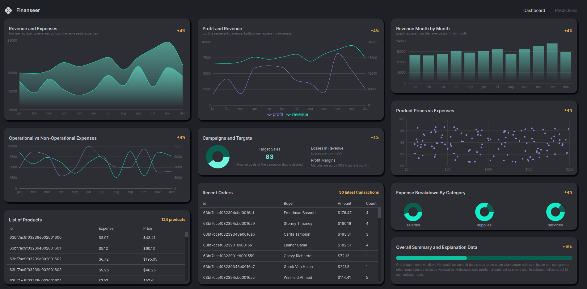
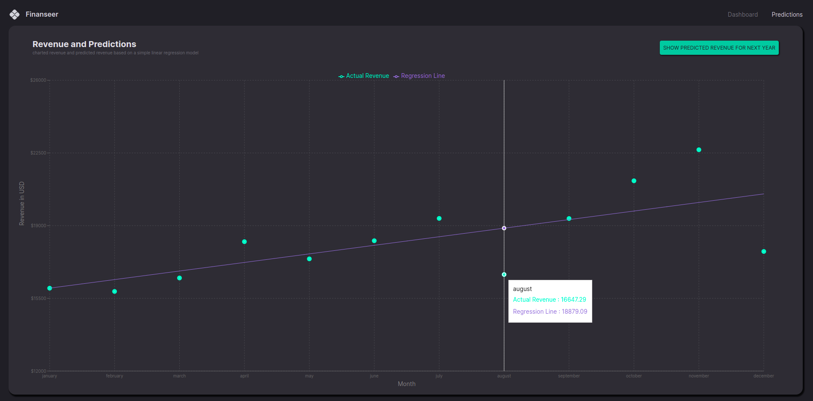

# Dashboard-app




## Demonstração
https://vinicinbraga.github.io/E-commerce-App/

Veja uma demonstração ao vivo aqui

## Instalação
1.Certifique-se de ter o Node.js instalado.
2.Clone este repositório para o seu ambiente local usando:
```bash
git clone https://github.com/VinicinBraga/E-commerce-App.git
```

3.Acesse o diretório do projeto:
```bash
cd E-commerce-App
```
4.Instale as dependências do projeto:
```bash
npm install
```

## Como usar

npm start

## Estrutura do Projeto
```bash
Netflix-Clone/
├── public/
├── src/
│   ├── assets/
│   ├── components/
│   │   ├── Cart.jsx
│   │   ├── Home.js
│   │   ├── Navbar.js
│   │   ├── Product.js
│   │   ├── Product.js
│   │   └── ...
│   ├── App.css
│   ├── App.js
│   └── ...
├── package.json
├── ...
└── README.md
```
## Contribuição
Contribuições são bem-vindas! Se você encontrar bugs, problemas ou tiver melhorias a serem sugeridas, abra uma issue ou envie uma solicitação de pull.

## Licença
Este projeto está licenciado sob a MIT License.

## Contato
Se você tiver alguma dúvida ou precisar entrar em contato, pode me encontrar em:

Email: vinicius@bragamatta.com ou vinibm85@gmail.com

GitHub: https://github.com/VinicinBraga

Linkedin: https://www.linkedin.com/in/vinícius-braga